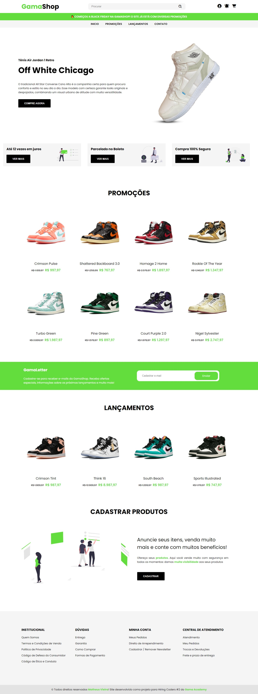

<h1 align="center"> 🛍 Ecommerce - GamaShop</h1>

  <strong>Site desenvolvido para Hiring Coders #2 da Gama Academy</strong>
   
  Criar um sistema de e-commerce para cadastro de email na landing page para recebimento de novidades e promoções.

  

  

  

  

### 💻 Site 

- <strong>[Ecommerce - GamaShop](https://gamashop.netlify.app)</strong>

## 🚀 Tecnologias

- HTML
- CSS
- JavaScript

- Dados sendo salvos no Local Storage

